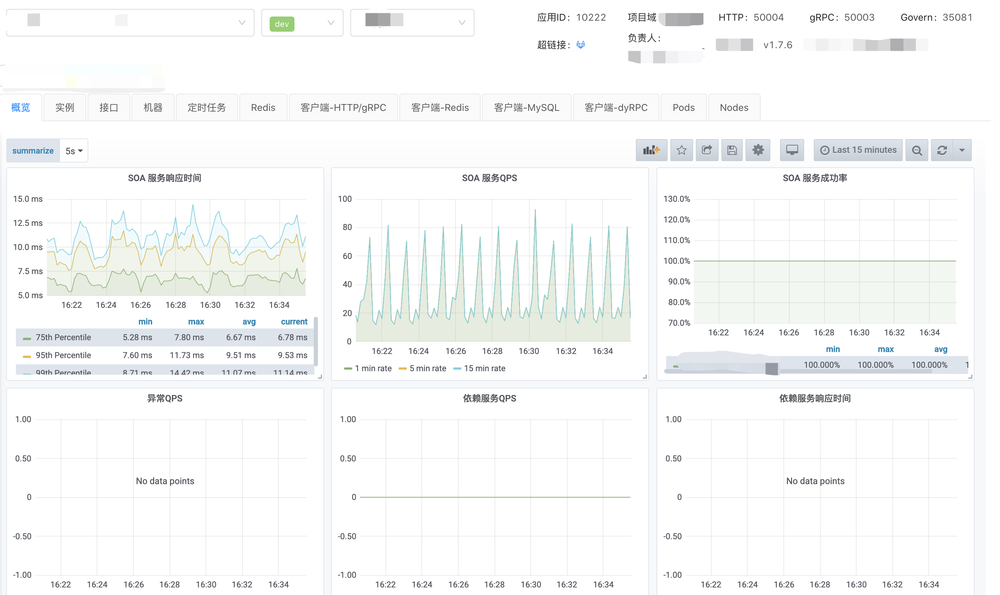
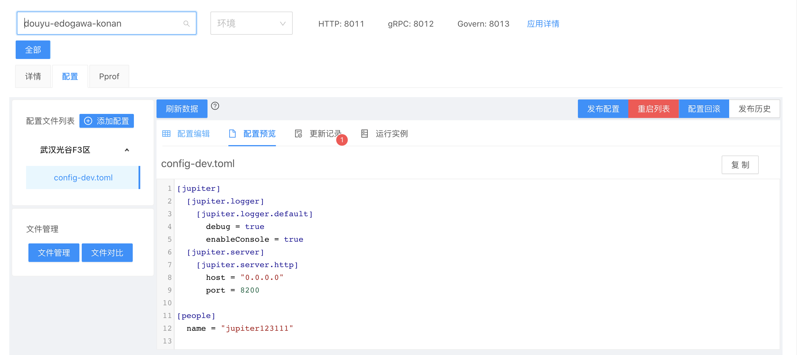
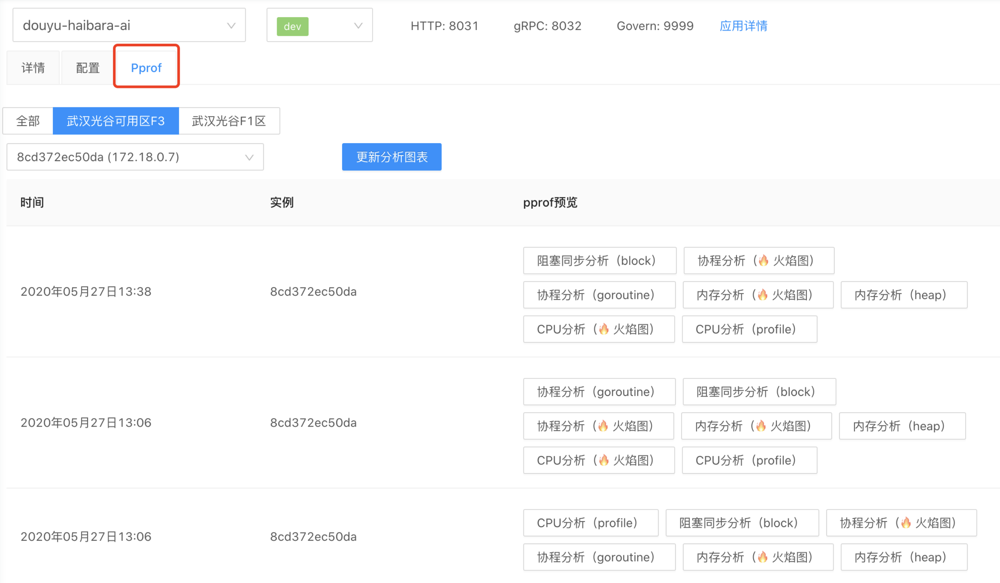

# 斗鱼Golang微服务框架-Jupiter开源# 斗鱼Golang微服务框架-Jupiter开源

Jupiter 是斗鱼开源的，面向服务治理的Golang微服务框架，以开发效率和治理效率为核心目标，从统一开发规范、
完善监控埋点、降低开发难度等多个维度来帮助Gopher开发高性能、高可靠性的微服务框架。

Jupiter在斗鱼内部经过三年打磨、几百个服务的线上验证，在多种应用场景中适配、历经多次基础架构迭代，
有效地保障了服务应用的快速迭代、精确监控，并在异地多活、容器云、混沌工程等基础建设中，支撑服务的平滑迁移、
平稳变更。近期，Jupiter Go v0.5.0 正式发布，与之同步发布的还有治理平台Juno。两者相得益彰，
帮助开发者快速落地、并具备服务治理能力的微服务架构。

## 微服务基础框架

现代微服务架构是分布式的，业务逻辑被拆分到不同的服务中，服务之间通过RPC相互调用。随着业务规模的增大，
服务的数量也随之增加，当增加到一定程度的时候，开发和运维效率将面临严重挑战。

斗鱼Web服务在服务化过程中为应对这种挑战，逐步形成了以Jupiter为核心的基础框架和以Juno为核心的治理平台。
Jupiter是作为面向服务治理的微服务基础框架，有四个核心关注点:
	• 开发效率: 提升开发效率、加速软件生命周期的迭代。
	• 治理效率: 提升治理效率，实现规模化治理。
	• 多场景应用: 识别通用场景，形成公共知识，持续提升团队开发效率。
	• 演进式架构: 保证服务在自建机房、容器云、网格化等基础架构变更和基础设施变更过程中的平滑迁移。

### 开发效率
开发效率是Web框架的核心关注点，好的Web框架融合了代码规范、最佳实践和安全编码，并能显著提高编码效率。如果是自研的框架，还承担着把组织内部的知识，进行抽象和提取，形成公共知识的责任。

同时，Golang作为一门“新”语言，生态相对也较“新”，实际使用还将面临一些“额外”风险：
	• 开源类库的质量和维护力度参差不齐，如果有bug或者不兼容问题，其修复难度较大。
	• Golang去中心化的依赖管理会导致类库管理困难，开发人员可以随意“引入”或“升降级”依赖库。
	• 不同类库的代码风格差异大，有一定使用成本。
	• Golang历经了多种包管理方式，对国内的开发者而言，俨然一部血泪史。目前gomod大有改善，但仍有个别老旧类库存在问题。

Jupiter是伴随斗鱼服务化一步步实践而来，经历了go1.7到go1.14既平滑（完美向前兼容）又剧烈（生态、依赖管理）的成长。针对业务的开发效率以及“额外”风险，Jupiter有一些基本的认识:
	• 以monorepo的方式整合核心框架、自研类库并包装第三方类库。长期看，这将极大减少维护成本。
	• 利用语言机制如type alias/type embedding等，封装常用的第三方类库，尽量减少直接引用第三方类库。这提供了一种缓冲机制，避免依赖被随意“升降级”，第三方bug也可以被方便管控。
	• 通过包装，一些关键类库万不得已的时候可以切到自研，也可以由自研切换到开源，降低维护成本。
	• 统一所有包的使用方式，包括配置驱动、统一错误码、统一日志埋点、指标埋点等，减少开发人员心智负担。

当然，上述很多问题不能仅仅依赖于基础框架来解决，并且随着Golang语言和生态的发展，一些问题也在不断缓解。但核心的需求还在，即通过整合基础框架，降低风险，提高效率。

除了针对主要开发环境的效率提升外，Jupiter针对调试、测试、CI流程等方面也做了一些工作，以提高整个软件周期的效率。

### 治理效率
治理效率是微服务架构的关键需求。微服务架构中，应用数总是不断上升，人均应用维护数增加到一定数目以后，维护效率将大幅度下降。如果碰到突发事件，将产生严重后果。因此，微服务架构非常强调服务治理能力和应用管理能力。一般来说，微服务治理包括：
	• 服务注册与发现: 服务注册、负载均衡等
	• 可观测性: 拓扑关系、指标、日志、链路等
	• 流量管理: 流量特征识别、流量导向等，以及基于此的灰度、蓝绿发布、A/B Test等细分应用
	• 安全策略: 访问控制、限流熔断等
	• 生命周期: 发布、下线管理，版本控制等

微服务治理是一项基础能力，需要代码规范、治理平台、基础框架甚至组织架构等多个方面协作，才能达到比较好的效果。

在治理平台部分，我们近期会开源了治理平台juno，释放部分微服务治理能力，未来还将整理和释放更多的治理能力，并与社区共建，进一步完善微服务治理。这部分，我们将在单独的文档中进行更详细说明。

在基础框架的部分，我们认为基础框架是沟通业务与治理平台的关键，一定程度上也定义了服务治理流程。在Jupiter中，针对服务治理，有几个关键点：
	• 增强核心模块可观测性：完善的日志、指标、链路埋点，并形成规范，从而实现报表、报警直出。
	• 统一错误码:  规范的错误码和错误收敛机制，能够极大的提升错误定位和排查速度。
	• 拦截器支持: 针对http/grpc的server/client以及redis/mysql/mongo/rocketmq等IO，全部支持拦截器机制，以进一步支持更丰富的治理策略。
	• 安全策略内置: 主要模块内置限流熔断、访问控制、慢查询监测等安全策略。
	• 流量路由和管理: 提供多种负载均衡和流量路由策略，以及针对A/B Test、影子流量等细分场景的流量策略。

### 多应用场景
支持多应用场景前，需要准确的识别应用场景，而识别的过程就是一个规范代码、探索实践的过程。应用场景的定义可以很宽泛，这里举几个例子简单说明：
	• 缓存策略。缓存的策略有很多种，在Web开发领域也经常使用。我们注意到业务实现中，经常会有数据过期时，一个请求穿透、多个请求原地block的场景。通过引入滑动窗口和半衰期，让一个请求穿透、多个请求正常返回，从而实现更高效的缓存策略。
	• 与Java Dubbo流量互通。dubbo支持gRPC协议，因此在协议层，dubbo与grpc-go是可以流量互通的。Jupiter通过增加一个基于接口(dubbo的默认注册方式)的服务注册键，从而实现服务注册与发现层面上的流量互通。
	
类似的例子在Jupiter中还有很多，如任务编排、流程编排、redis的并发pipeline、在线压测的mysql影子流量等。

应用场景的识别是形成公共知识、加速团队开发效率的重要手段。

### 演进式架构
Web开发和运维技术在不断的发展，短短几年已涌现出了非常多的计算形态，如云计算、边缘计算、容器化、网格化、Serverless等。服务保障技术方面，异地多活、混沌工程也在不断发展。语言栈方面，很多公司也在从早期单一的PHP、Java栈扩大到多语言栈并存的局面，特别是近年来Golang因在容器化和运维效率上的优势，越来越多的被应用到Web服务开发。但每次技术迭代，享受效率提升的同时，也在不断经历应用改造和迁移的痛苦。

从应用的角度来看，面对的是一个不断变化的外部环境，新的问题不断产生。以斗鱼Web服务部为例，可以通过一个时间线管中窥豹:
	• 应用开始服务化: 这个阶段开始构建大量的基础治理平台，包括发布中心、监控中心、注册中心及各个管理细分平台。 同时，一些新的基础设施开始引入，如etcd，prometheus、jager等。
	• 语言栈从单一的PHP扩展为Golang、Java、PHP的多语言栈。API规范、服务互通在这个阶段凸显。
	• 多机房建设: 流量管控、服务质量、安全策略的要求凸显。
	• 容器化: 传统基于IP/Port的治理方式、流量管理和分发、服务监控需要做出相应改变。
	• Service Mesh: 基于SDK的服务注册、发现，监控需要适配。
总体上，基础架构的变更将对整个治理体系产生影响，特别是治理平台。正视变化，并前瞻性和针对性的优化，将有助于减少外部环境变化对业务逻辑的影响，并享受整个生态进步带来的效率提升。

## 结语
以上是Jupiter对微服务架构实践的一些核心关注点和功能的介绍。详细的介绍，欢迎大家访问 [GitHub - douyu/jupiter: Jupiter是douyu开源的面向服务治理的Golang微服务框架](https://github.com/douyu/jupiter)来了解。

鉴于治理平台开源Juno还在做开源前的整理准备，这里放上几张截图供大家了解。

Jupiter Go正在快速迭代，v0.5.0包含了基本的架构骨架，更多的功能也在逐步整理，并将尽快释放出来。我们非常欢迎感兴趣的开发者参与贡献，一起来丰富Jupiter的功能、推动未来版本的演进。